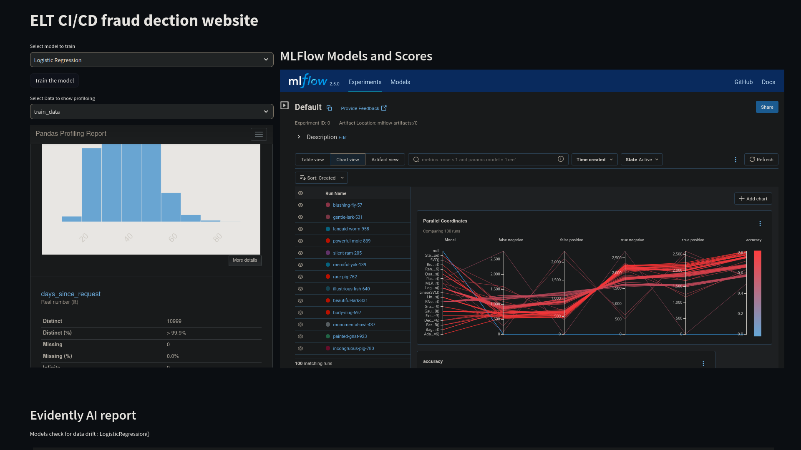
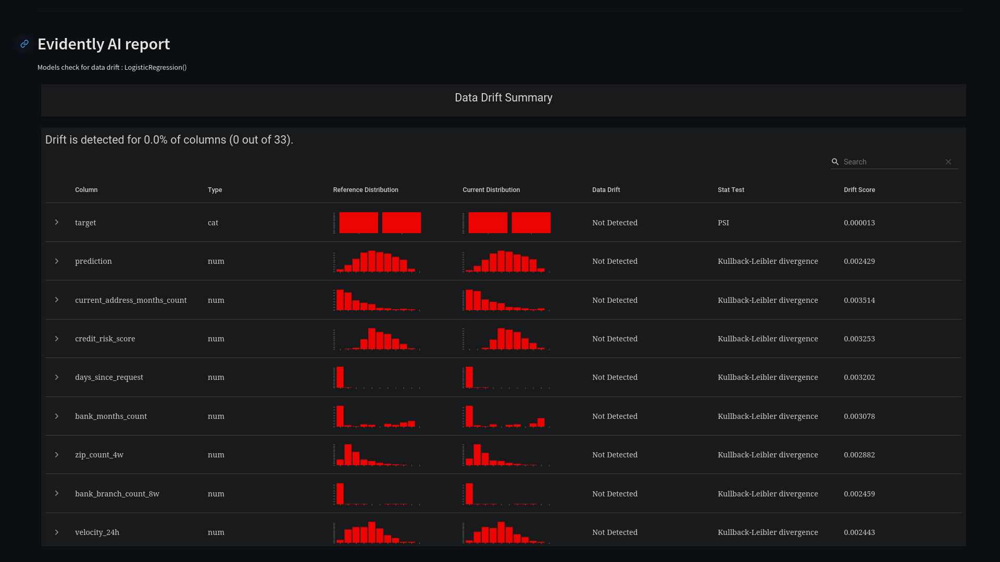

### Pipeline TODO list
- [x] UI draft
- [x] prepare dataset from sqlite
- [x] add pandas profiling from the dataset (use HTML to reduce using resources)
- [x] add mlflow page and reload
- [x] add evidently report
- [ ] make bash script file (focus on make file)
- [x] create make file
- [x] add to docker
- [ ] add testing (just add for show)
- [ ] add ci/cd pipeline (it take alot for precommit)
- [ ] add prefect to orchestrate (further study)

### known error
* Bz of insuffient knowledge on docker there is error in mlflow bz localhost and host are umatched.
* Therefore add --host docker netwrok in Makefile in make run like : 
    `mlflow server --backend-store-uri sqlite:///reports/backend.db --host 172.8.0.2:5000 &`
## ETL CI/CD fraud detection website project

The end product is the final website deployment.
* Using Scikit-learn models to train. ( I want to add an ensemble model)
* Prefect to orchestrate the whole project (it is hard to add but I will try)
* MLFLow + Streamlit to show the train model score
* Evidently + Streamlit shows the main report 
* Data profile? pandas_data_profiling?

### Streamlit website 

Take all the functions and variables to build the website
report MLflow model accuracy in streamlit 
report evidently in streamlit 
can I do this? if prefect is running, show that is running
    
    
    #---------------------------------------------------------#
    |    model_select                  |                      |
    |    train, predict, custom, look  |  MLFlow model score  |
    |    custom -> select feature /    |       dataframe      |
    |               random gen values? |                      |
    |                                  |                      |
    |                                  |                      |
    |---------------#------------------#----------------------|
    |               |                                         |
    |  <T, P data>  |                                         |
    |  Pandas       |         Evidently report of             |
    |  Data         |      Data shift and concept drift       |
    |  Profiling    |       classification and score          |
    |               |                                         |
    |               |                                         |
    |               |                                         |
    #---------------|-----------------------------------------#

There is three Database.
* This is for evidently database prograsql -> store report file (different solution html file)
* MLflow database sql_lite -> store mlfile
* Prefect database sql_lite -> store process file (further study)
  
Another thing that I like to add
* how about creating a class that can call variables easily
* like data.train, data.valid_dataset, data.current_dataset
* Also testing the function and others. pylint black etc.
* Make file, setup and bash file. 
* CI/CD precommit 
* Docker and make file and also bash script.

#### Further adding
1. model monitoring and fine tuning
2. prefetct 
3. automation

